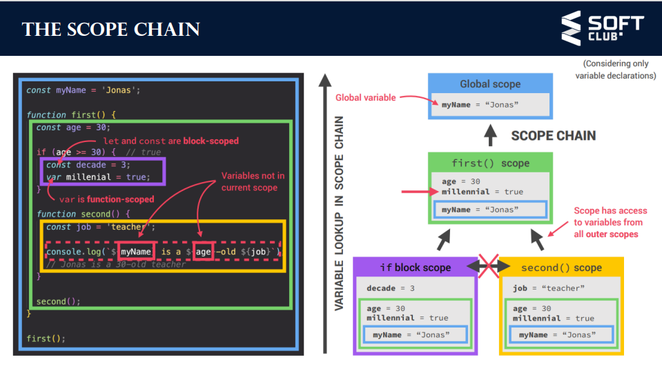
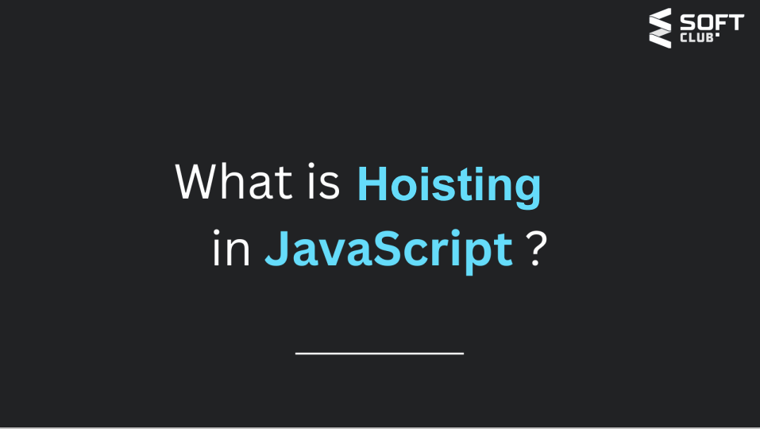
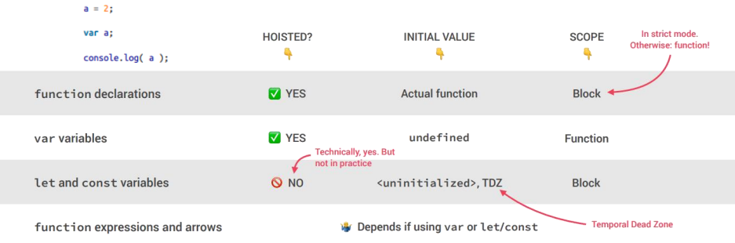
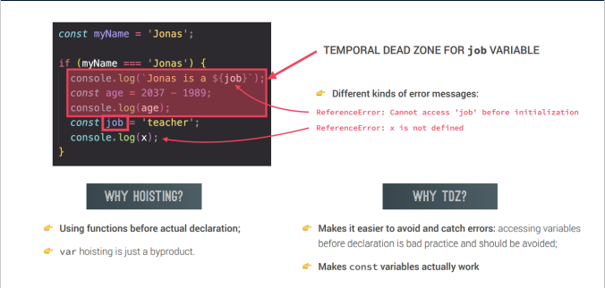

"# home_2"  
# what a Scope in JS
- область видимости — это текущий контекст выполнения, в котором значения и выражения
являются «видимыми» или на них можно сослаться. если переменная или выражение не находятся в текущем
масштаб, он не будет доступен для использования. области также могут быть разделены на слои в иерархии,
чтобы дочерние области имели доступ к родительским областям, но не наоборот
# JavaScript has the following kinds of scopes: javascript имеет следующие виды областей видимости:
- глобальная область: область по умолчанию для всего кода, работающего в режиме сценария.
- область действия функции: область действия, созданная с помощью функции.
- javascript имеет следующие виды областей видимости:
область блока: эта область ограничивает объявленную переменную
внутри определенного блока, от доступа снаружи блока. 

 - область модуля: область действия кода, работающего в модульном режиме.
 # add
 -  
  - 
  - 
  - подъем — это механизм javascript, в котором переменные и функцииобъявления перемещаются в верхнюю часть своей области перед кодом исполнение
  - 
  # Hoisting – Variable (var) 
  - есть соблазн подумать, что весь код, который вы видите в JavaScript программа интерпретируется построчно, сверху вниз, как программа
выполнять. хотя это по существу верно, есть одна часть этого как- предположение, которое может привести к неправильному мышлению о вашей программе
- 
# Hoisting – function declaration подъем — объявление функции
- Итак, один из способов мышления, своего рода метафора, об этом процессе состоит в том, что переменная и функция
объявления «перемещаются» из того места, где они появляются в потоке кода, в начало код. это приводит к поднятию имени
# Temporal dead zone, let and const временная мертвая зона, пусть и const
- 